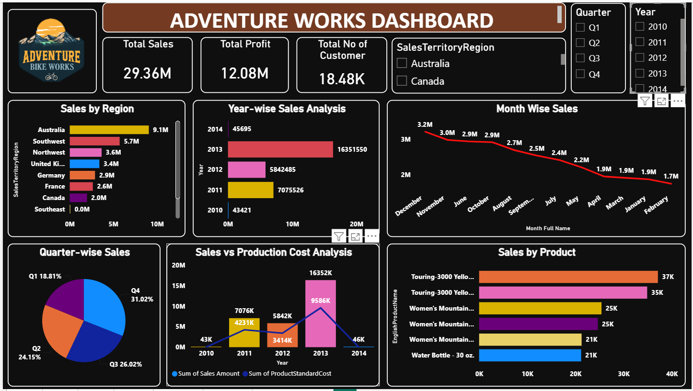

# 📊 Adventure Works Sales Analytics Dashboard | Power BI | Tableau

## 📌 Project Overview

The **Adventure Works Sales Analytics Dashboard** is an interactive Business Intelligence solution developed using **Power BI** to analyze sales performance, customer distribution, regional sales, product performance, and profitability.

The dashboard transforms raw sales data into actionable business insights through interactive visualizations, KPI cards, and dynamic filters, enabling business stakeholders to monitor performance and support data-driven decision-making.

---

# 🎯 Business Objective

The objective of this project is to analyze Adventure Works sales data and answer important business questions such as:

- What is the overall sales performance?
- Which regions generate the highest sales?
- How has sales performance changed over the years?
- Which products contribute the highest revenue?
- What is the relationship between sales and production cost?
- How do quarterly sales compare?
- How many customers contribute to total sales?

---

# 🛠 Tech Stack

| Category | Tools |
|----------|-------|
| Business Intelligence | Power BI | Tableau |
| Data Transformation | Power Query |
| Data Modeling | Power BI Data Model |
| Calculations | DAX |
| Dataset | Adventure Works Dataset |
| Visualization | Power BI | Tableau |

---

# 📂 Dataset Information

The project uses the **Adventure Works** sales dataset, which contains:

- Customer Information
- Product Details
- Sales Transactions
- Sales Territory
- Date Dimension
- Product Cost
- Sales Amount

---

# 📊 Dashboard Preview



---

# 📈 Key Performance Indicators (KPIs)

| KPI | Value |
|------|-------|
| 💰 Total Sales | 29.36M |
| 📈 Total Profit | 12.08M |
| 👥 Total Customers | 18.48K |

---

# 📊 Dashboard Features

### 🌍 Regional Sales Analysis

- Sales by Sales Territory
- Region-wise Performance Comparison

### 📅 Year-wise Sales Analysis

- Annual Sales Trend (2010–2014)

### 📆 Month-wise Sales Trend

- Monthly Sales Performance
- Sales Trend Analysis

### 📦 Product Performance

- Top-Selling Products
- Product-wise Sales Comparison

### 💵 Sales vs Production Cost Analysis

- Compare Sales Revenue with Product Standard Cost
- Analyze Business Profitability

### 🥧 Quarter-wise Sales Distribution

- Quarterly Sales Contribution
- Sales Percentage by Quarter

### 🎛 Interactive Filters

- Sales Territory Region
- Quarter
- Year

---

# 🔄 Data Cleaning & Transformation

The dataset was prepared using **Power Query**.

Data preparation included:

- Removing duplicate records
- Handling missing values
- Changing data types
- Creating relationships
- Building the data model
- Creating calculated columns
- Preparing the dataset for reporting

---

# 📊 Data Visualizations

The dashboard includes:

- KPI Cards
- Clustered Bar Charts
- Line Chart
- Pie Chart
- Combo Chart
- Interactive Slicers
- Dynamic Filters

---

# 💡 Key Business Insights

- Australia generated the highest sales among all sales territories.
- Total sales reached **29.36M**, generating **12.08M** in total profit.
- The business experienced peak sales performance during **2013**.
- Quarter 4 contributed the highest percentage of annual sales.
- Touring Bike products generated the highest sales.
- Sales consistently exceeded production costs, indicating strong business profitability.

---

# 📁 Repository Structure

```text
Adventure-Works-Sales-Analytics/
│
├── Adventure_Dataset.zip
├── Adventure_Tableau.twbx
├── Adventure_Works_Dashboard.png
├── Adventure_Works_Sales_Dashboard.pbix
└── README.md
```

---

# 🚀 Getting Started

1. Clone this repository.

```bash
git clone https://github.com/Rahul140901/Adventure-Works-Sales-Analytics
```

2. Open the **Adventure_Works_Sales_Dashboard.pbix** file using **Power BI Desktop**.

3. Explore the interactive dashboard using filters and slicers.

4. (Optional) Open **Adventure_Tableau.twbx** using Tableau Desktop to explore the Tableau version of the dashboard.

---

# 🎯 Skills Demonstrated

- Power BI
- Tableau
- Business Intelligence
- Dashboard Development
- Data Visualization
- Data Analysis
- Power Query
- DAX
- Data Modeling
- KPI Reporting
- Interactive Reporting
- Business Analytics

---

# 📬 Connect With Me

**Rahul Vishnu Shewale**

📍 Pune, Maharashtra, India

📧 rahulshewalepatil500@gmail.com

🔗 LinkedIn

https://www.linkedin.com/in/rahul-shewale-190039315/

---

## ⭐ If you found this project helpful, please consider giving it a star!
